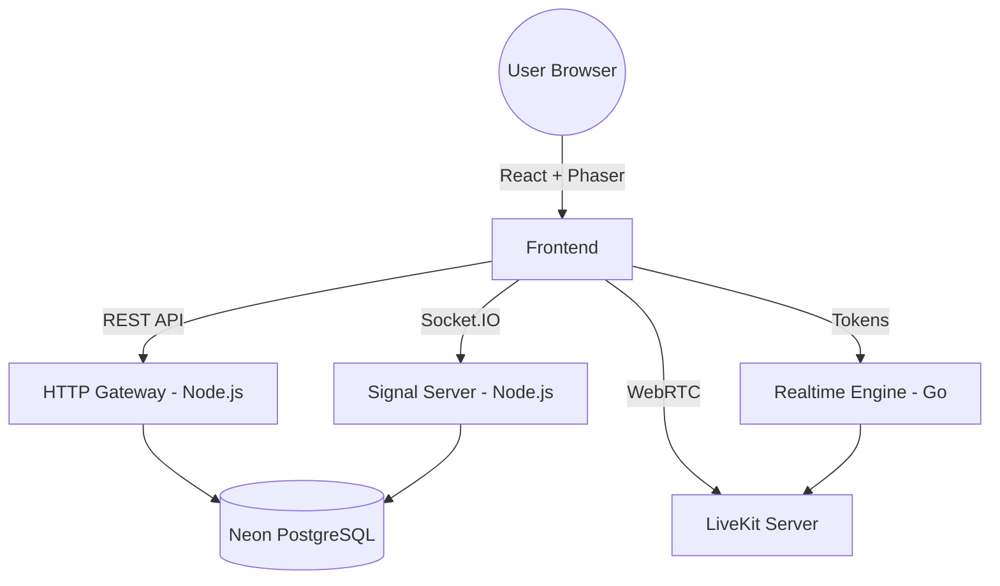

# AxioVerse - 2D Metaverse Platform

AxioVerse is a high-performance, real-time 2D metaverse platform that enables users to explore virtual spaces, interact with physics-based worlds, and connect via proximity-based video and audio chat.

## 🏗️ Architecture

The project is structured as a **Turborepo** monorepo, separating core logic into distinct micro-services for scalability and performance.



### 📂 Service Directory

| Path | Service | Tech Stack | Responsibility |
| :--- | :--- | :--- | :--- |
| `apps/frontend` | Client | React, Vite, Phaser | Game engine, UI, and media handling |
| `apps/http` | REST API | Express, Prisma | Authentication, spaces, and user data |
| `apps/ws` | Signal | Socket.IO | Real-time movement and state sync |
| `apps/go-realtime-engine`| Engine | Go | High-perf token generation & future logic |
| `packages/db` | Database | Prisma | Shared database access layer |

---

## 🛠️ Prerequisites

- **Node.js** (v18+)
- **Go** (v1.20+)
- **PostgreSQL** (Neon cloud or local)
- **LiveKit Server** (installed via Homebrew or Binary)

---

## 🚀 Getting Started

### 1. Installation
Install all dependencies from the root directory:
```bash
npm install
```

### 2. Database Setup
Ensure your `.env` is configured with `DATABASE_URL`, then generate the Prisma client:
```bash
npx prisma generate --schema packages/db/prisma/schema.prisma
```

### 3. Running Services
You can start all services concurrently using Turbo:
```bash
npm run dev
```

Alternatively, run individual services for focused debugging:
- `npm run dev` (in specific app folders)
- `go run main.go` (in `apps/go-realtime-engine`)

---

## 📶 Multi-Device & LAN Testing

AxioVerse is configured for dynamic networking, allowing you to test on mobile devices or other laptops on your Wi-Fi without manual IP updates.

1.  **Frontend**: Run `npm run dev` and open the **Network** URL (e.g., `http://172.20.10.2:5173`).
2.  **Backends**: All services automatically bind to `0.0.0.0` to accept external connections.
3.  **LiveKit**: Start the LiveKit server with explicit LAN flags:
    ```bash
    livekit-server --dev --bind 0.0.0.0 --node-ip <YOUR_MAC_IP>
    ```

> [!TIP]
> **Dynamic IP Detection**: The frontend automatically calculates all API endpoints based on your browser's hostname. Use the IP-based URL on all devices to ensure connectivity.

---

## 🔑 Environment Variables

Create a root `.env` file with the following:

```env
DATABASE_URL="your-postgresql-url"
JWT_PASSWORD="your-secret-password"

IMAGEKIT_PUBLIC_KEY="your-key"
IMAGEKIT_PRIVATE_KEY="your-key"

PORT=3000
WS_PORT=8081
```

---

## 🎨 Branding
The platform uses custom hand-drawn sprites (Warrior, Mage, Rogue) and a vibrant "Axio" design system powered by Tailwind and Vanilla CSS.
